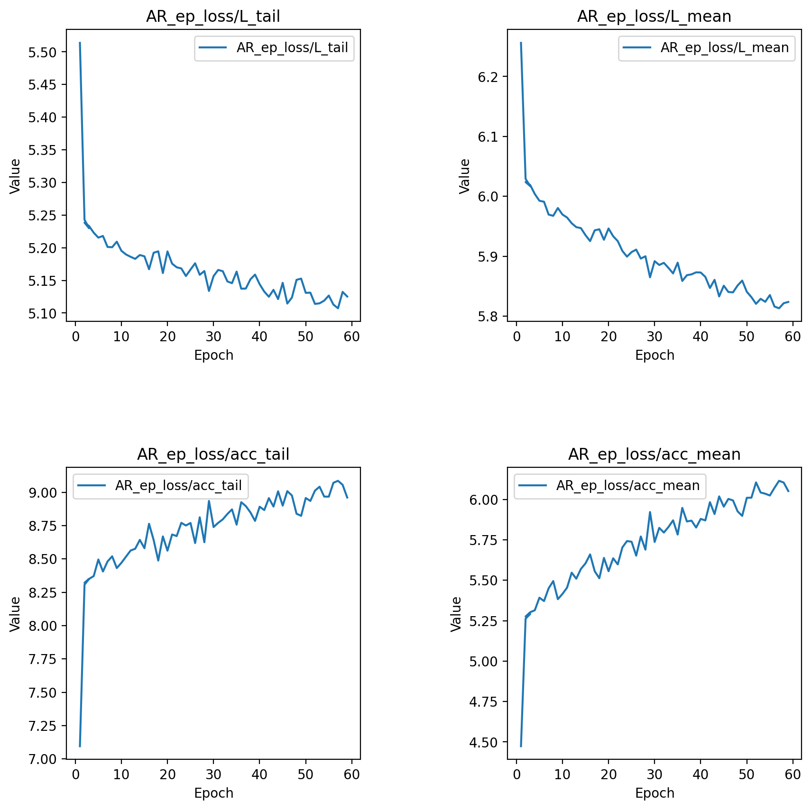

# Text2Image VAR

**This repository is used to investigate the performance and properties of the newly proposed [VAR image generation paradigm](https://github.com/FoundationVision/VAR). We re-implemented part of the code and extended it into a text-to-image model using CLIP. We trained the model on the MS COCO 2017 dataset.**


<div style="text-align: center;">


The process of VAR generation given the prompt "a dog".

</div>

## Experimental Details

Environment setup:
```shell
./environ_setup.sh
```


The code to generate and save CLIP features in advance:
```shell
python save_clip_data.py
```

To run the training:
```shell
./run-training.sh
```

For testing:
```shell
python gen_img.py
```


Due to limitations in computational resources, we utilized the VAR model with a depth of ``20``, as mentioned in the original paper, which contains approximately 600 million parameters. For comparison, the DALL-E model has about 12 billion parameters, nearly 20 times larger than ours. We loaded the ImageNet-pre-trained model weights released by the authors of VAR directly and re-initialized the modules involved in computing text features.

We skipped the first stage of training the VQVAE and directly used the pre-trained VQVAE released officially by the VAR team, which was trained on [OpenImage](https://storage.googleapis.com/openimages/web/index.html) using a compound loss. Our model
used a shared codebook with ``V = 4096`` vectors and a latent space dimension of ``32``.
Our model was trained with a base learning rate of ``1 × 10−4`` and a batch size of ``64``. We used the AdamW optimizer, with ``β1 = 0.9``, ``β2 = 0.95``, and a ``weight decay of 0.05``. Notably, under this paradigm, since we conduct parallel training for predictions across more than 10 different scales for each image, the training required a significant amount of VRAM. We employed 8 Nvidia A10 GPUs, each with 24GB of VRAM, for parallel training, and a batch size of 64 was the maximum we could achieve. Accordingly, with a 10-step next-scale-prediction setup, this is equivalent to expanding the dataset size by approximately tenfold, thereby extending the time required for each epoch. Specifically, training 100 epochs on the COCO dataset using 8 Nvidia A10 GPUs took
more than 10 days. Consequently, we were only able to complete 60 epochs of training on COCO. Simultaneously, we also conducted 100 epochs of training on variously sized subsets of COCO to observe the training dynamics and results.

## Training and Validation Dynamics
Below are training and validation loss/accuracy curves. The dynamics shows the pattern of overfitting. However the quality of generated images was still increasing after epoch 10.


<div style="text-align: center;">



</div>

<div style="text-align: center;">


</div>

## Qualitative Results
We manually set several text prompts, as shown in the Table. These text prompts range
from those with simple semantic information that appear in the training data, such as ``a dog``, to those with relatively complex semantic content and multiple objects, like ``a group of people sitting under an umbrella``. Some prompts describe natural scenes, such as ``A serene meadow at sunrise, with mist gently rising from the ground``, while others depict cultural scenes, like ``A bustling marketplace in an ancient, cobblestone-lined city``. Some scenarios are plausible in real life, for instance, ``A cozy cabin nestled in a snowy forest, smoke billowing from the chimney``, and some are purely imaginative, like ``a teddy bear on a skateboard in Times Square``. We used the models trained on the full sample for different epochs to generate the images, with ``cfg=4``.

| Row | Column | Prompt                                                                                              |
|-----|--------|-----------------------------------------------------------------------------------------------------|
| 1   | 1      | A dog                                                                                               |
| 1   | 2      | A group of people sitting under an umbrella                                                          |
| 1   | 3      | A human face with a hat                                                                             |
| 1   | 4      | A serene meadow at sunrise, with mist gently rising from the ground                                 |
| 1   | 5      | An abandoned city reclaimed by nature, with vines creeping up the skyscrapers                       |
| 1   | 6      | A futuristic metropolis bustling with flying vehicles and neon lights                               |
| 1   | 7      | A cozy cabin nestled in a snowy forest, smoke billowing from the chimney                            |
| 1   | 8      | A magical garden filled with vibrant flowers and whimsical creatures                                |
| 2   | 1      | A vast desert landscape with towering sand dunes and a lone camel caravan                           |
| 2   | 2      | An underwater world teeming with colorful coral reefs and exotic fish                               |
| 2   | 3      | A mystical castle perched on a cliff overlooking a turbulent sea                                    |
| 2   | 4      | A bustling marketplace in an ancient, cobblestone-lined city                                        |
| 2   | 5      | A fantastical realm where floating islands drift among cotton candy clouds                          |
| 2   | 6      | A futuristic space station orbiting a distant planet, with sleek, metallic architecture             |
| 2   | 7      | A dog playing a computer                                                                            |
| 2   | 8      | A teddy bear on a skateboard in Times Square                                                        |

<div style="text-align: center;">
Prompts for Image Generation*
</div>

Below are the generated images:

<div style="text-align: center;">


Images generated by the model trained for 30 epochs.

</div>

<div style="text-align: center;">


Images generated by the model trained for 45 epochs.

</div>

<div style="text-align: center;">


Images generated by the model trained for 55 epochs.

</div>

## Quantitative Results

<div style="text-align: center;">


</div>


